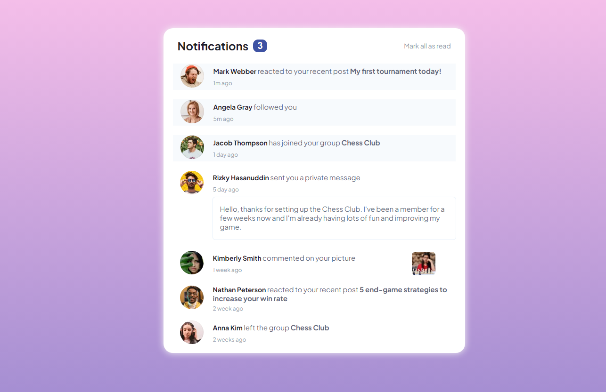

<h1 align = "center"> 
    Frontend Mentor - Notifications page  
    Welcome! 👋 I'm Devanshu 
</h1>

This is a solution to the [Notifications page challenge on Frontend Mentor](https://www.frontendmentor.io/challenges/notifications-page-DqK5QAmKbC). Frontend Mentor challenges help you improve your coding skills by building realistic projects. 

## Table of contents

- [Overview](#overview)
  - [The challenge](#the-challenge)
  - [Screenshot](#screenshot)
  - [Links](#links)
- [My process](#my-process)
  - [Built with](#built-with)
  - [What I learned](#what-i-learned)
  - [Continued development](#continued-development)
- [Author](#author)

---

## Overview

### The challenge

Users should be able to:

- Distinguish between "unread" and "read" notifications
- Select "Mark all as read" to toggle the visual state of the unread notifications and set the number of unread messages to zero
- View the optimal layout for the interface depending on their device's screen size
- See hover and focus states for all interactive elements on the page

### Screenshot

### Links

- Live Site URL: [Notification Main Page](https://devanshu78.github.io/Notifications-main-page/)

## My process

### Built with

- Semantic HTML5 markup
- CSS custom properties
- Flexbox
- Mobile-first workflow

### What I learned

I learned about design and responsiveness of web site. Some meta tags for better SEO of web site. 

### Continued development

This project help me to build any social media application or any other application where notification section is important. There is many things to learn about this section to use into production or in real life application.

## Author

- Website - [Devanshu](https://github.com/Devanshu78/Notifications-main-page)
- Frontend Mentor - [@Devanshu78](https://www.frontendmentor.io/profile/Devanshu78)

